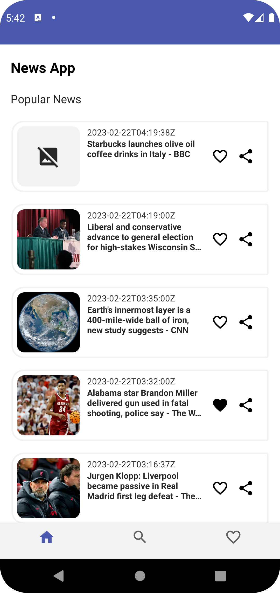
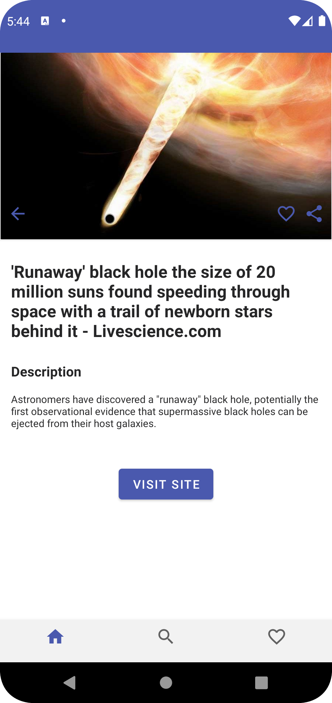
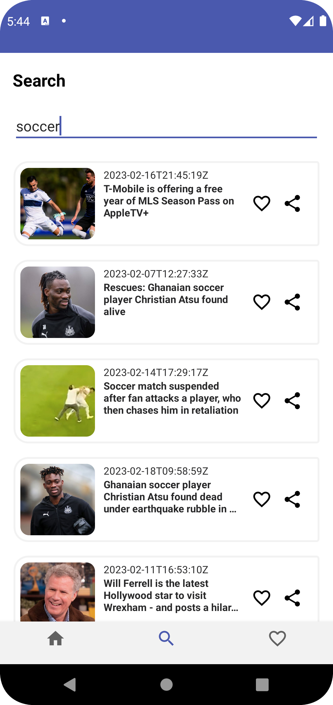
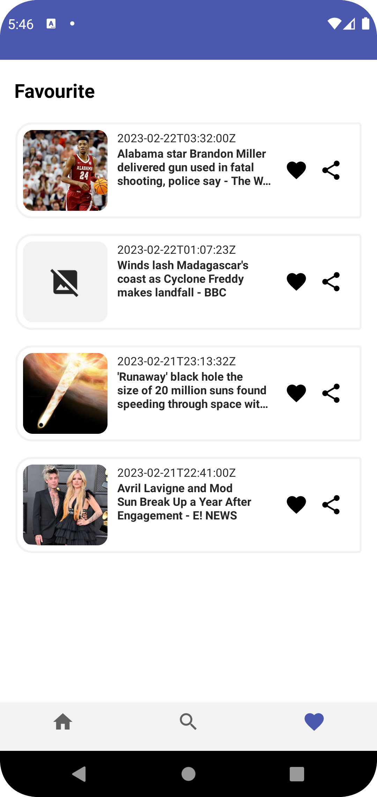

# News Android App

## About project

<b>News App</b> is the simple news aggregator application on a popular stack.

## Technology Stack

Android SDK, Fragment, Kotlin, MVVM, NavigationComponents, ViewModel, Room, LiveData, KotlinCoroutines, Retrofit, Hilt, Glide.

## Features

The application is written in Kotlin and is based on the Single Activity approach using Fragmnets and Navigation Components. The architecture of the application is MVVM.

The application downloads news using the News API (https://newsapi.org). Retrofit is used to generate and read requests to the REST API.

The application has the ability to download the latest most popular news, search for news by keyword, save news to the local Room database, and share the news.

Most of the actions in the application are performed in Coroutines. The fragment data is stored in its ViewModel in LiveData format.

Hilt is used as the DI. Glide is used to download images by URL.

## Screenshots

  
   

  
   

